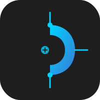

<p align="center">
  
</p>

# 🚀 **Chuscraper: The Only Scraper You'll Ever Need** 🚀

---

# 🕸️ Chuscraper: Undetectable & Agentic Web Scraping

[English](README.md) | [Documentation](https://github.com/ToufiqQureshi/chuscraper/docs) | [Examples](examples/)

[](https://pypi.org/project/chuscraper/)
[](https://opensource.org/licenses/MIT)
[](https://pypi.org/project/chuscraper/)
[](https://github.com/ToufiqQureshi/chuscraper)

[Chuscraper](https://github.com/ToufiqQureshi/chuscraper) is a high-performance *web scraping* framework that combines **Military-Grade Stealth** with **Autonomous AI Agency**. It bypasses the toughest bot protections (Akamai, DataDome, Cloudflare) while allowing you to scrape using natural language.

---

## ⚡ **Key Advantages**

- **🛡️ 100% Undetectable**: Built-in Canvas noise, Hardware spoofing, and UA rotation.
- **🤖 Autonomous AI Pilot**: Just give a goal like *"Find all hotels in Bali under $100"* and Chuscraper will navigate and extract it for you using its A11y-tree brain.
- **👁️ Multi-modal Vision**: Screen-based extraction for sites with obfuscated HTML or Canvas-heavy layouts.
- **🔒 CDP Proxy Auth**: Native authenticated proxy support without clunky extensions.
- **🔄 Self-Healing**: Automatically generates robust selectors that survive website redesigns.

---

## 🚀 **Quick Install**

```bash
# Core framework (Stealth + High Performance)
pip install chuscraper

# Advanced AI Suite (Pilot, Vision, Agentic Logic)
pip install chuscraper[ai]
```

---

## 💻 **Usage**

### 1. **Autonomous Search (AI Pilot)**
Reach any target without writing a single selector.

```python
import asyncio
from chuscraper import start

async def main():
    browser = await start(headless=False)
    page = await browser.get("https://www.makemytrip.com/")

    # AI Pilot analyzes the page and performs the search
    await page.ai_pilot("Search for hotels in Goa for next weekend")
    
    # Extract data semantically
    data = await page.ai_extract("First 3 hotels with prices")
    print(data)

    await browser.stop()

if __name__ == "__main__":
    asyncio.run(main())
```

### 2. **Multi-modal Visual Extraction**
If the data is in an image or a complex chart, use Vision.

```python
# Extract data directly from the rendered viewport
result = await page.ai_visual_extract(
    prompt="Extract the stock price from the chart image",
    schema=StockDataModel
)
```

---

## 🚀 **Integrations**
Chuscraper is built to integrate with your existing AI stack:

- **LLM Support**: Gemini 1.5 Pro/Flash (Default), OpenAI GPT-4o, Local LLMs (Ollama).
- **Frameworks**: Fully async-compatible with FastAPI, LangChain, and CrewAI.
- **Output**: Built-in Pydantic support for structured, validated JSON output.

---

## 📖 **Documentation**
Looking for the full API guide? Check out our [Documentation](https://github.com/ToufiqQureshi/chuscraper/docs).

- **Stealth Tuning**: How to maximize camouflage.
- **Proxy Management**: Advanced proxy rotation patterns.
- **AI Prompting**: Best practices for Agentic scraping.

---

## 🔥 **Benchmark**
Chuscraper is optimized to be **2x faster** than Playwright-based AI scrapers due to its raw CDP implementation and lightweight protocol handling.

---

## 🤝 **Contributing**
Feel free to contribute! Join our community to discuss improvements.
Please see the [contributing guidelines](CONTRIBUTING.md).

---

## 📄 **License**
Chuscraper is licensed under the MIT License.

Made with ❤️ by [Toufiq Qureshi]
