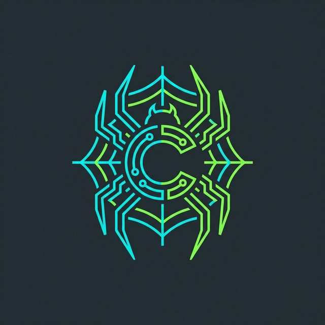
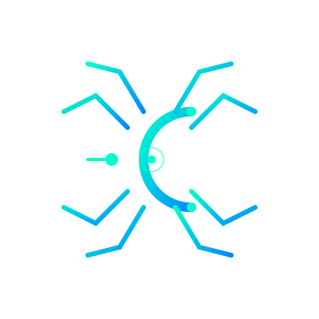

🚀 **Looking for an even faster and simpler way to scrape at scale (only 5 lines of code)?** Check out our enhanced version at [**Chuscraper.com**](https://github.com/ToufiqQureshi/chuscraper)! 🚀

---

# 🕷️ Chuscraper: You Only Scrape Once

[English](README.md) | [中文](docs/chinese.md) | [日本語](docs/japanese.md)
| [한국어](docs/korean.md)
| [Русский](docs/russian.md) | [Türkçe](docs/turkish.md)
| [Deutsch](docs/german.md)
| [Español](docs/spanish.md)
| [français](docs/french.md)
| [Português](docs/portuguese.md)

[](https://pepy.tech/projects/chuscraper)
[](https://github.com/ToufiqQureshi/chuscraper)
[](https://opensource.org/licenses/MIT)

[](https://github.com/ToufiqQureshi/chuscraper)

<p align="center">
<a href="https://github.com/ToufiqQureshi/chuscraper" target="_blank"></a>
</p>

[Chuscraper](https://github.com/ToufiqQureshi/chuscraper) is a *web scraping* python library that uses LLM and direct CDP logic to create scraping pipelines for websites and local documents (XML, HTML, JSON, Markdown, etc.).

Just say which information you want to extract and the library will do it for you!

<p align="center">
  
</p>


## 🚀 Integrations
Chuscraper offers seamless integration with popular frameworks and tools to enhance your scraping capabilities. Whether you're building with Python, using LLM frameworks, or working with AI agents, we've got you covered with our comprehensive integration options.

**Integrations**:
- **Providers**: OpenAI, Gemini (Native), Anthropic, Ollama
- **LLM Frameworks**: Langchain, Llama Index, Crew.ai, Agno
- **Output Protocols**: Pydantic, JSON, CSV, Markdown, Excel
- **Stealth**: Built-in Canvas/WebGL noise, Hardware spoofing, UA rotation.

## 🚀 Quick install

The reference page for Chuscraper is available on the official page of PyPI: [pypi](https://pypi.org/project/chuscraper/).

```bash
pip install chuscraper

# FOR AI CAPABILITIES
pip install chuscraper[ai]
```

**Note**: it is recommended to install the library in a virtual environment to avoid conflicts with other libraries 🐱


## 💻 Usage
There are multiple standard scraping methods that can be used to extract information from a website (or local file).

The most common one is the `ai_pilot`, which autonomously navigates and extracts information from a page given a user goal.


```python
import asyncio
from chuscraper import start

async def main():
    # Start the stealth browser
    browser = await start(headless=False)
    page = await browser.get("https://www.makemytrip.com/")

    # Define the goal
    print("AI is starting to search...")
    await page.ai_pilot("Search for hotels in Goa for next weekend")
    
    # Extract structured data
    result = await page.ai_extract("Extract first 3 hotels with prices")
    
    import json
    print(json.dumps(result, indent=4))

    await browser.stop()

if __name__ == "__main__":
    asyncio.run(main())
```

> [!NOTE]
> For OpenAI and other models you just need to pass the provider!
> ```python
> from chuscraper.ai.providers import OpenAIProvider
> provider = OpenAIProvider(api_key="YOUR_OPENAI_API_KEY")
> await page.ai_extract("Extract data", provider=provider)
> ```


The output will be a structured dictionary like the following:

```python
{
    "hotels": [
        {
            "name": "Taj Exotica Resort & Spa",
            "price": "₹ 25,000",
            "rating": "4.8"
        },
        {
            "name": "Cygnett Inn",
            "price": "₹ 4,500",
            "rating": "4.2"
        }
    ]
}
```

## 📖 Documentation
The documentation for Chuscraper can be found in the [docs/](docs/) folder.

## 🤝 Contributing

Feel free to contribute and join our community to discuss improvements and give us suggestions!

Please see the [contributing guidelines](CONTRIBUTING.md).

## 🔥 AI Methods

| Method Name           | Description                                                                                                      |
|-------------------------|------------------------------------------------------------------------------------------------------------------|
| ai_pilot                | Single-goal autonomous navigator that handles interaction (clicks, types) to reach a target.                    |
| ai_extract              | Semantic data extractor that converts HTML content into structured JSON/Pydantic models.                        |
| ai_visual_extract       | Multi-modal Vision scraper that extracts data directly from the rendered page screenshot.                       |
| ai_learn_selector       | Self-healing tool that generates robust CSS/Xpath selectors for long-term automation.                           |
| ai_ask                  | Context-aware Q&A that answers questions based on the current page's content.                                   |

## 🎓 Citations
If you have used our library for research purposes please quote us with the following reference:
```text
  @misc{chuscraper,
    author = {Toufiq Qureshi},
    title = {Chuscraper},
    year = {2026},
    url = {https://github.com/ToufiqQureshi/chuscraper},
    note = {An undetectable & agentic python library for scraping leveraging CDP and LLMs}
  }
```

## 📜 License
Chuscraper is licensed under the MIT License. See the [LICENSE](LICENSE) file for more information.

Made with ❤️ by [Toufiq Qureshi]
