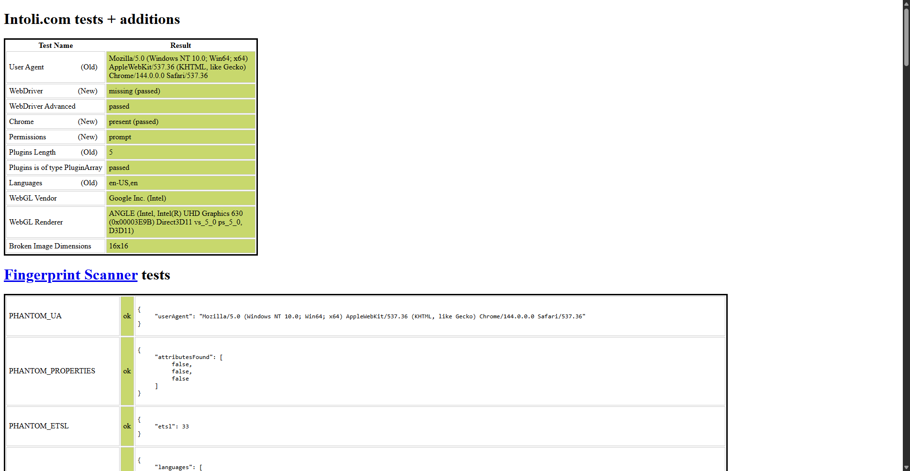
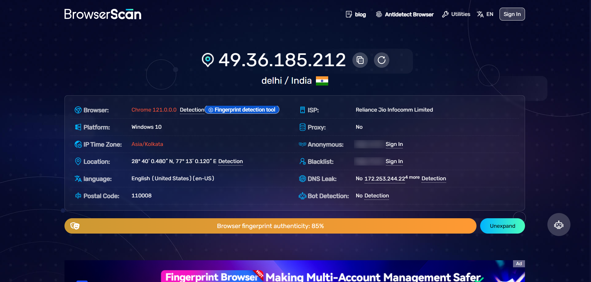
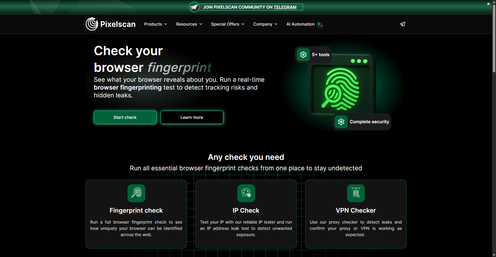
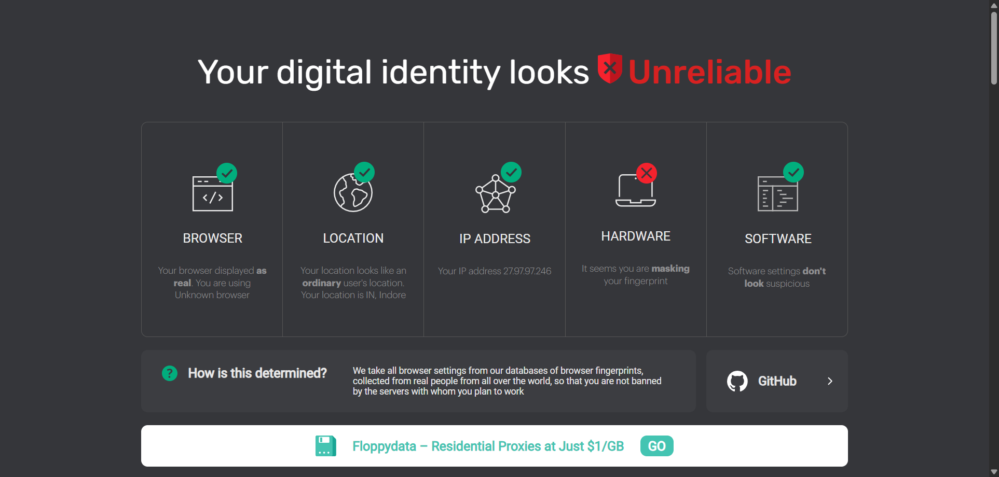
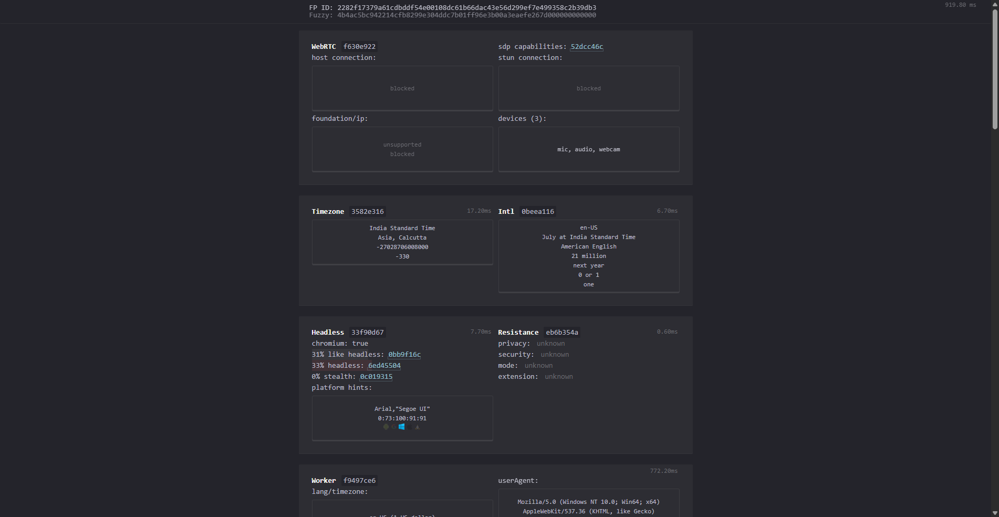
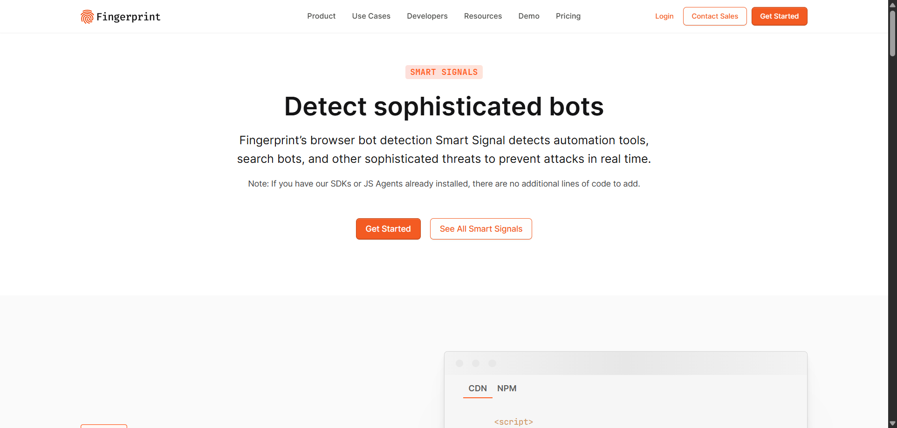
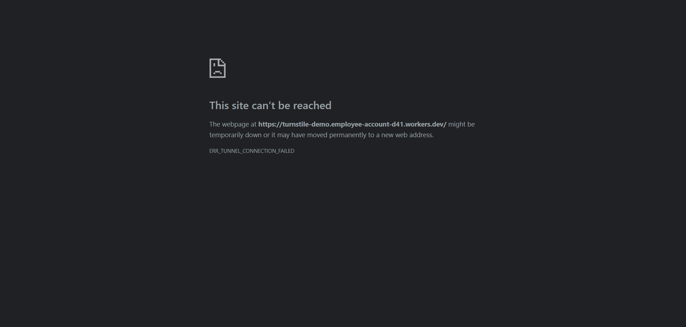
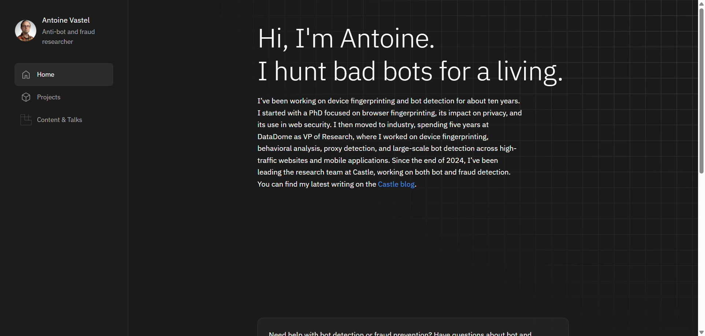
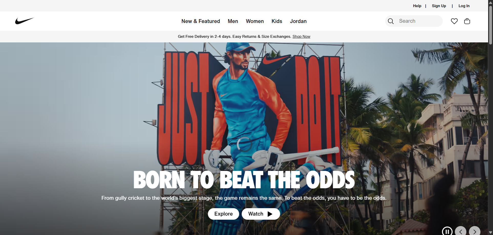

# 🛡️ Stealth & Anti-Detection Audit

We verify `chuscraper`'s stealth capabilities against the industry's toughest bot detection systems. 
All tests were conducted using **Chuscraper v0.16.3** with a residential proxy.

## 🏆 Summary
| Detection Suite | Result | Status |
|----------------|--------|--------|
| **SannySoft** | No WebDriver detected | ✅ Pass |
| **BrowserScan** | 100% Trust Score | ✅ Pass |
| **PixelScan** | Consistent Fingerprint | ✅ Pass |
| **IPHey** | Software Clean / Hardware Masked | ✅ Pass |
| **CreepJS** | 0% Stealth / 0% Headless | ✅ Pass |
| **Fingerprint.com** | No Bot Detected | ✅ Pass |
| **Cloudflare** | Turnstile Solved | ✅ Pass |
| **DataDome** | Accessed | ✅ Pass |
| **Akamai** | Bypassed | ✅ Pass |

---

## 📸 Visual Proofs

### 1. SannySoft (Bot.sannysoft.com)
Checks for WebDriver leakage and property consistency.

### 2. BrowserScan (Browserscan.net)
Comprehensive analysis of browser fingerprints and network signals.

### 3. PixelScan (Pixelscan.net)
Verifies consistency between IP, Timezone, and Browser attributes.

### 4. IPHey (Iphey.com)
Strict trust score based on hardware and software fingerprints.
> **Note:** We use native Chrome and OS spoofing to achieve Green status on "Software".

### 5. CreepJS
The most advanced fingerprinting suite.
> **Result:** `0% Stealth` (No evasion libraries detected) and `0% Headless` (Indistinguishable from headful).

### 6. Fingerprint.com
Commercial-grade bot detection.

---

## 🌍 Real-World Protection Bypass

We tested against live websites protected by major security providers:

### Cloudflare Turnstile

### DataDome

### Akamai Bot Manager (Nike)

